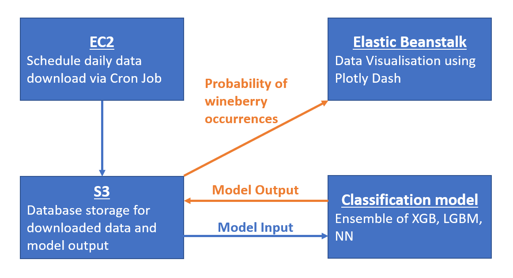

## Installation

### Connect to AWS
- Update the `config.py` file in main directory by entering your AWS credentials.
- **NOTE** : You will need to have access to AWS services to generate the data and train the model, although you can find a local copy of the data under the data folder, model checkpoints under the model_output folder and model predictions under the output folder.

### Data Collection

- `gbif.py` Run this script to download the GBIF dataset

    - `get_rubus_dataset(year)` downloads GBIF dataset for wineberries to a csv file of a particular year. This can be looped to obtain multiple years of data

- `process_GBIF.py` Run this script after running `gbif.py` to process the downloaded GBIF data

    - Processes the GBIF dataset to attempt to find states if missing from Lat / Lon Coordinates

- `ghcnd_stations.py` Run this script to download the ASDI dataset
  
    - `ghcnd_station_txt_to_csv(filename, output_path)` downloads GHCN-D stations around the world to a csv file

    - `merge_df(year, station_path, output_path)` downloads daily historical climate data of a specific year and merges them with GHCN-D stations based on station id
    
    - `combine_years(file_path, output_path)` combines all the different years of data collected into a single csv

    - `group_data(filename)` groups climatic data by date and states in US into a single csv

- `nasa.py` Run this script to download the NASA dataset
    
    - `download(output_path)` downloads solar and meteorological from NASA by states in US
    
    - `combine_states(file_path, output_path)` combines data from different states into a single csv


### Model

- `model.py` Run this script to train and evaluate the model and upload the predictions to S3 Database

    - `load_asdi` loads the ASDI dataset from the Amazon S3 Database
    
    - `load_gbif` loads the GBIF dataset from the Amazon S3 Database
    
    - `load_nasa` loads the NASA dataset from the Amazon S3 Database
    
    - `process_and_merge` merges the GBIF data (wineberry presence data [Target = 1]) with the ASDI data (temperature and precipitation features)
    
    - `generate_absence_data` generates the absence data [Target = 0]
    
    - `merge_absence_and_presence` merges the presence and absence dataframe and processes it by cleaning
    
    - `process_nasa_data` processes the NASA dataset (format and clean)
    
    - `merge_nasa` Merges the dataframe obtained from `merge_absence_and_presence` with the processed NASA dataset from `process_nasa_data`
    
    - `feat_eng1` fixes dataframe format and generates additional feature(s)
    
    - `get_train_test_and_feature` gets the train and test dataframe, splitting by year
    
    - `train_lgb` train the lgb model and returns the oof and test predictions
    
    - `train_xgb` train the xgb model and returns the oof and test predictions
    
    - `train_nn` train the nn model and returns the oof and test predictions
    
    - `generate_preds_post_process` generates the ensemble predictions
    
    - `update_s3_db` Updates the S3 database with our prediction results


### Frontend

-  Install dependencies

    ```commandline
    pip install -r requirements.txt
    ```

- Start dash application

    ```commandline
    python application.py
    ```
    
    You can view the application at http://127.0.0.1:8000.

### Deployment
  
- Deploy to AWS Elastic Beanstalk
  ```commandline
  eb init
  eb create
  ```

---

# Project Description

## Introduction

This project is an investigation of the spread dynamics of an invasive species, essentially, it analyses the "spreadability" of an invasive species from an affected to unaffected area. More specifically, our exploration focuses on the spread dynamics of wineberries (Rubus phoenicolasius) of [affected states](https://nyis.info/invasive_species/wineberry/) in the US. This is done by examining environmental factors affecting plant growth such as solar radiation, soil moisture, temperature, etc... in the different locations and predicting the probability of the presence of wineberries in these areas.

---
## Data Generation


1. [NOAA Global Historical Climatology Network Daily (GHCN-D)](https://aws.amazon.com/marketplace/pp/prodview-dzppucmwfpuk4?sr=0-1&ref_=beagle&applicationId=AWSMPContessa)
- Collect Daily Temperature Data for all the US states


2. [Global Biodiversity Information Facility (GBIF)](https://www.gbif.org/occurrence/search)
- Collect Wineberry (*Rubus phoenicolasius*) occurrences in all US states from (2009 - Present) to generate presence data.
- Absence data is then obtained by sampling the 50 US states equally to pull non-occurrence data over the same period of (2009 - Present)
- This allows us to have a balanced dataset


3. [NASA Power Project Data Catalog](https://power.larc.nasa.gov/data-access-viewer/)
- Collect solar and meteorological data such as Solar Radiation, Wind Speed, Pressure, etc...

The datasets are combined and stored the AWS S3 Cloud Database which allows for easy retrieval during model training.

---

## Model and Post Processing

We built an ensemble of 3 Models : XGboost (XGB), LightGBM (LGBM) and a Neural Network (NN) on a binary classification task which takes as inputs the environmental feature set discussed in the above section to predict wineberry occurrences. We then convert the logits to a value between (0 and 1), representing the probability of occurrence then evaluating our model's results using AUC (Area Under ROC Curve). Our Models are able to achieve about a 0.96 AUC Score which represents an accurate set of predictions. The imperfect score also tells us that there is a probability of the spread of wineberries to other states in the US that are not affected.

The results are then extracted and averaged over the the entire time period for all 50 states to generate an average probability of wineberry occurrences. This final result is plotted on an interactive map using [Dash](https://dash.plotly.com/) and deployed on [AWS Elastic Beanstalk](http://asdi-project-dev.ap-southeast-1.elasticbeanstalk.com/).



---

## UN Sustainable Development Goal (UNSDG) and Inspiration

Life on Land (Biodiversity) is one of the UNSDGs that is least talked about. This is because the impacts and effects of biodiversity loss are often long term and hence not very obvious to many of us. This does not mean that the effects of the loss Biodiversity should not concern us. Biodiversity loss often mean worsening climate change since many ecosystems trap carbon dioxide and when ecosystems are heavily impaired, it could also mean that we may not be able to enjoy some of the food that we enjoy now.

Our inspiration stems from a previous project done on biodiversity preservation and species distribution modelling. I had the idea then that the species distribution of any plant or animal is highly dependent on the balance of its ecosystem. But what if there was a disruption of this ecosystem? What would happen to the distribution of the particular species then? Unfortunately, the idea only remained as a possible extension and was not implemented. We're thankful that this competition provided us the platform to transform what was then a small extension/idea into a full fledged project. We hope that through our project, we can highlight the importance of our Biodiversity and also explore more creative ways to mitigate biodiversity loss and protect our ecosystems.

---

## Contributors

[](https://github.com/maze508)[](https://github.com/guanquann)
